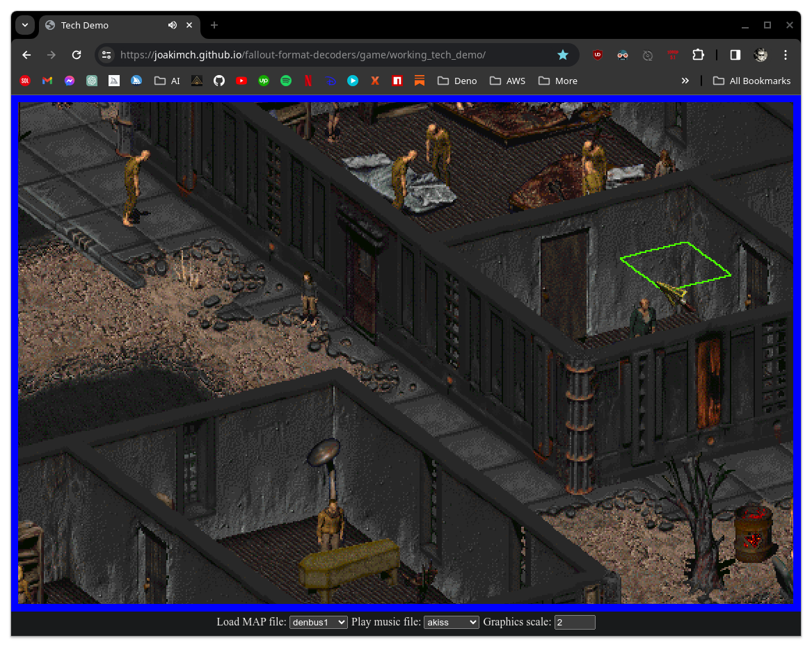
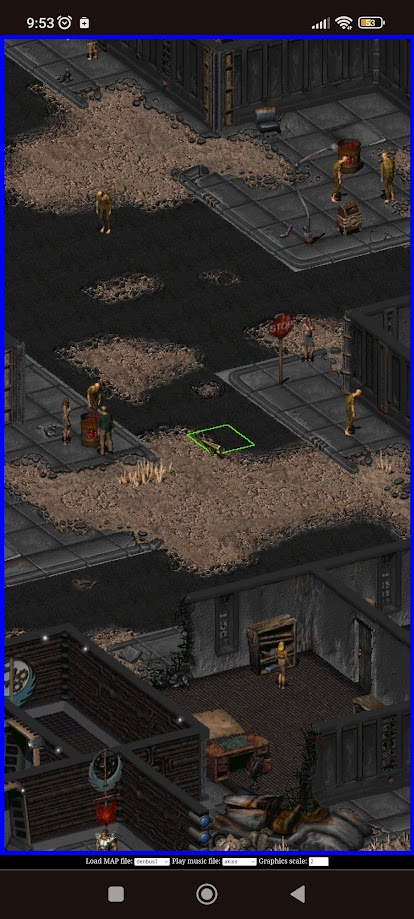

# A game inspired by Fallout 1 & 2 (and for now using the same graphics / audio). 

# 🛑🚧 Work In Progress! 🚧🛑
The game is in an alpha stage and nowhere near complete!

## Disclaimer:

The Fallout 1 & 2 assets are copyrighted by Bethesda Softworks and are only used here for demo purposes. In any final game I can't legally use them, unless loaded locally from an already installed Fallout game.

>Hence I reach out to any modders who have made their own Fallout compatible assets; please let me know if I can use them in my game. The authors of such assets will then be listed in the credits. 😎

> I'm also looking into having an AI re-create the assets (please let me know if you can help with that also).

## Some screenshots:

## A short description.

This game is a part of my bigger project which you can read about [here](../readme.md). It will be a new game (not a clone), but heavily inspired by the classic Fallout games. And it will be designed to run entirely in the browser, at least in any Chromium based browsers (Chrome, Edge, Brave, etc) and probably also Firefox.

In an effort to avoid any legal problems by using the Fallout assets; the game will be able to load the assets locally from your own Fallout 2 installation (so I can easily remove them from this website if needed). This is a functionality you're free to test, but it doesn't work with Firefox yet (because they have not implemented the needed [Web File API](https://developer.mozilla.org/en-US/docs/Web/API/File_API)).

Also the game will be entirely open source with an MIT license (which is very open)! Meaning that anyone is free to use the game engine to create their own "Fallout-like" games in the browser; as long as they give some credit to me for this engine ([just read the license](license.MIT))!

## A working tech demo!

A working tech demo will be maintained to showcase some of what we can do so far. It might not always be entirely up to date though; since it will be a snapshot of the code in a working (or somewhat working) state. So we can continue to work on the code in a somewhat "unstable manner"...

[Click here to try out the "working tech demo".](https://joakimch.github.io/fallout-format-decoders/game/working_tech_demo/)

[Click here to try out "whatever we're currently working on" (which might not even work).](https://joakimch.github.io/fallout-format-decoders/game/source/)

## So who's the team behind this?

Currently it's only me Joakim L. Christiansen and I've been programming as a hobby since around 2005. I have the skills to pull this off, but my life is currently a mess and I desperately could need some funding ([GitHub Sponsorship](https://github.com/sponsors/JoakimCh)) to help me, my 2 kids and my wife continue to have food at our table! That would help development a lot! 🙏

## So what is the game going to be like?

It's also going to be a post apocalyptic RPG like the Fallout games, but it will have a story of my own. Meaning that it will not be in the "Fallout universe", but in one which is similar.

The story and the humor will probably end up being darker and more messed up. 😆 I'm really looking forward to doing lots of story telling! 😃

Also the "game mechanics" are going to be very different. Nothing is written in stone yet, but I want the game to be more realistic. Maybe skills will be earned through experience (by actually using the skills) instead of leveling up and just spreading "skill points". And it might not be turn-based (or optionally).

I will probably also experiment with text to speech and maybe even ChatGPT integration for automated quests and/or conversations and/or storytelling...

#### Stuff I might want to do:

* A more modern game and graphics engine, e.g. smooth camera movement, bigger maps...
* Allow using new graphics from Fallout 2 mods like e.g. [Olympus 2207](https://olympus2207.com/) and [Fallout: Sonora](https://falloutmods.fandom.com/wiki/Fallout:_Sonora)?
* Allow it to be very easy for anyone to make their own stories and expand the game or make their own games.
* Some procedurally generated content, maybe locations, quests, etc...
* Research if ChatGPT can be used to generate unique game-play or randomize parts of it?
* Lots of random stuff I'll mention later...

## The development process.

[Read about it here.](../development.md)

## Well, that's it for now!

I'll expand this readme with more info as we go.
